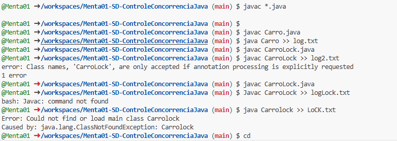
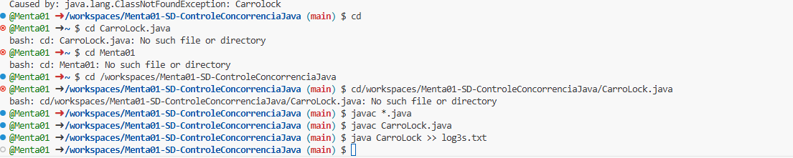

# Menta01-SD-ControleConcorrenciaJava

Carro.java representa um cenário de concorrência descontrolada, onde as threads (carros) podem acessar as vagas de forma simultânea, o que pode gerar problemas de consistência e segurança nos dados (vagas).
CarroLock.java utiliza locks ou algum mecanismo de sincronização para garantir que as vagas sejam ocupadas e liberadas de maneira controlada, evitando os problemas encontrados no primeiro exemplo, mas com um impacto no desempenho devido à espera das threads.